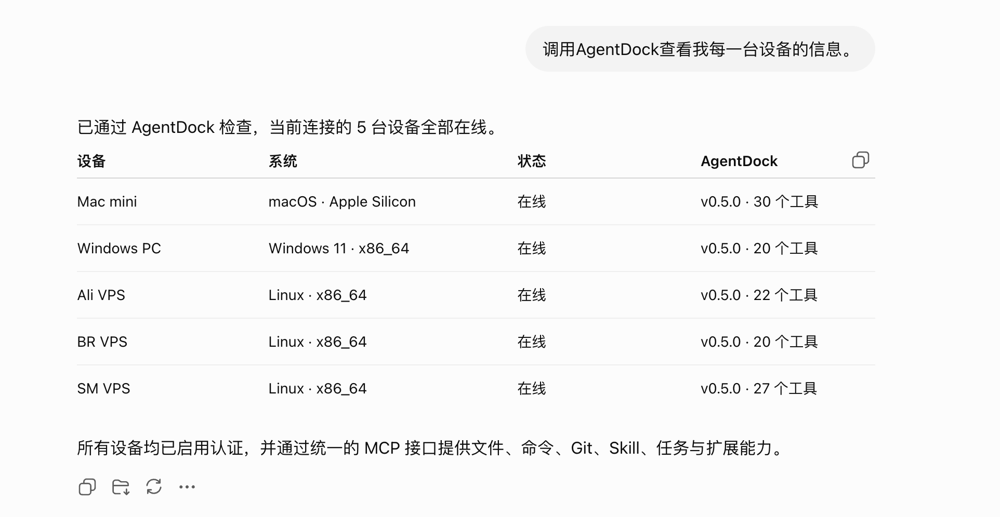

<div align="center">

# AgentDock

**为 AI 装上触达每一台设备的双手。**

面向 AI Agent 的独立工具运行层，为本地电脑、远程服务器与容器环境提供统一、安全、可控的文件、命令、Git、Skill、MCP、浏览器自动化和任务执行能力。

[快速开始](https://uvwt.github.io/agentdock-docs/docs/getting-started/install) · [在线文档](https://uvwt.github.io/agentdock-docs/) · [版本发布](https://github.com/uvwt/agentdock/releases) · [问题反馈](https://github.com/uvwt/agentdock/issues)

[](https://github.com/uvwt/agentdock/actions/workflows/ci.yml)
[](https://github.com/uvwt/agentdock/releases)
[](https://hub.docker.com/r/agentdockio/agentdock)
[](https://github.com/uvwt/agentdock/pkgs/container/agentdock)
[](./LICENSE)

</div>

<p align="center">
  
</p>

## AgentDock 是什么

AgentDock 是一个面向 AI Agent 的独立工具运行层。

它将设备上的文件系统、命令执行、Git、Skill、动态 MCP、浏览器自动化和可恢复任务封装为统一的 MCP 能力，让不同 AI 客户端能够以一致的方式操作本地电脑、远程服务器和容器环境。

AgentDock 不提供聊天界面，也不负责模型推理。它专注于解决一件事：

> 让 AI Agent 在明确的权限边界内操作真实环境，并返回结构化、可追踪、可验证的执行结果。

```text
AI Client / Agent
        │
        │ MCP
        ▼
┌───────────────────────────────┐
│           AgentDock           │
│                               │
│ Files · Commands · Git        │
│ Skills · Dynamic MCP          │
│ Browser · Tasks · Recall      │
└───────────────┬───────────────┘
                │
                ▼
   Local machine / VPS / Docker
```

## 你可以用 AgentDock 做什么

- 让 AI 读取和修改本地项目，运行测试并操作 Git
- 让 AI 管理 VPS、Docker 服务和部署配置
- 让 AI 检查日志、进程、端口和真实运行状态
- 让 AI 操作登录后的网页与 macOS 桌面应用
- 通过 Skill 和动态 MCP 扩展外部能力
- 保存长时间任务的执行状态，并在中断后继续
- 用同一套工具模型连接 macOS、Linux、Windows 与容器环境

## 为什么使用 AgentDock

| 能力 | 说明 |
| --- | --- |
| 统一工具入口 | 通过一个 MCP 服务提供文件、命令、Git、Skill、任务和浏览器等能力 |
| 本地与远程一致 | 同一套工具模型可运行在 macOS、Linux、Windows、VPS 和 Docker 环境 |
| 明确执行边界 | 对路径、权限、超时、输出长度和敏感信息进行约束 |
| 结构化执行结果 | 区分工具调用状态、命令退出状态、标准输出和错误信息 |
| 可扩展运行时 | 支持独立 Skill 和动态 MCP Server，无需将所有能力写入核心程序 |
| 可恢复任务 | 支持任务步骤、检查点、阻塞、恢复、最终审查和完成条件 |
| 面向正式部署 | 提供 Docker、systemd、macOS 和 Windows 安装方式，并持续发布正式镜像 |

## 快速开始

普通用户不需要下载源码、安装 Go 或自行构建镜像。

完整安装入口：[安装 AgentDock](https://uvwt.github.io/agentdock-docs/docs/getting-started/install)

### Docker 部署

正式镜像同步发布到 GitHub Container Registry 和 Docker Hub。Release 附带的 Compose 文件默认使用 GHCR，正式镜像以非 root 用户运行。

```bash
mkdir agentdock
cd agentdock

curl -fL \
  https://github.com/uvwt/agentdock/releases/latest/download/docker-compose.yml \
  -o docker-compose.yml

export AGENTDOCK_AUTH_TOKEN="$(openssl rand -hex 32)"

docker compose pull
docker compose up -d
```

查看运行状态：

```bash
docker compose ps
docker compose logs -f
```

默认 MCP 地址：

```text
http://127.0.0.1:18766/mcp
```

停止服务：

```bash
docker compose down
```

完整配置、数据持久化和客户端接入方式见 [Docker 快速部署](https://uvwt.github.io/agentdock-docs/docs/getting-started/docker)。

## 接入 AI 客户端

AgentDock 通过 MCP Streamable HTTP 提供工具能力。下面是一个通用配置示例，具体字段格式取决于所使用的 AI 客户端：

```json
{
  "mcpServers": {
    "agentdock": {
      "url": "http://127.0.0.1:18766/mcp",
      "headers": {
        "Authorization": "Bearer <AGENTDOCK_AUTH_TOKEN>"
      }
    }
  }
}
```

如果 AgentDock 仅监听本机回环地址并明确关闭认证，可以不发送 `Authorization` 请求头。对局域网或公网开放时，必须启用认证，并配置 HTTPS 和网络访问控制。

## 平台安装

| 平台 | 文档 |
| --- | --- |
| Docker | [Docker 快速部署](https://uvwt.github.io/agentdock-docs/docs/getting-started/docker) |
| Linux | [Linux 自动安装](https://uvwt.github.io/agentdock-docs/docs/getting-started/linux) |
| Linux / VPS | [systemd 部署](https://uvwt.github.io/agentdock-docs/docs/getting-started/vps) |
| macOS | [macOS 安装](https://uvwt.github.io/agentdock-docs/docs/getting-started/macos) |
| Windows | [Windows 原生安装](https://uvwt.github.io/agentdock-docs/docs/getting-started/windows) |

每个平台文档均包含安装命令、启动检查、MCP 地址和认证方式。浏览器自动化、macOS 桌面操作、Windows / WSL、反向代理和数据迁移等内容位于对应进阶文档。

## 版本更新

正式 Release 二进制支持直接查看版本和更新：

```bash
agentdock --version
agentdock update
```

`agentdock update` 会下载匹配当前平台的最新 Release，校验 SHA-256 并验证新二进制，然后备份和替换当前版本。检测到 LaunchAgent、systemd、Windows Service 或 Windows 用户启动项时，会自动重启并验证新版本；失败时恢复旧版本。开发构建不能通过该命令更新。

## 核心能力

### 文件与命令

- UTF-8 文本读取、搜索、目录遍历和结构化修改
- 原子文件写入、路径边界和私密目录保护
- 有超时和输出边界的命令执行
- 标准输出、标准错误和退出码分离
- 长时间命令会话、PTY、会话观察、输入和停止
- 输出截断和敏感信息脱敏
- macOS、Linux、Windows 与 WSL 支持

### Git 与 GitHub

- 仓库状态、差异和提交记录读取
- 分支、提交、拉取和推送
- GitHub 仓库访问检查
- 修改前状态检查和修改后差异验证

### Skill 与动态 MCP

- Skill 包校验、安装、激活和回滚
- 稳定版、开发版、Canary 和固定版本通道
- Skill 独立环境变量与运行环境
- 动态 MCP Server 注册、启停、刷新和移除
- Streamable HTTP 与 stdio 传输
- 工具搜索、Schema 检查和受控调用
- MCP Server 之间的配置隔离

### 浏览器与桌面自动化

- 浏览器会话启动、关闭和清理
- 页面跳转、点击、输入、选择和等待
- 页面文本、可交互元素、错误和网络响应检查
- 登录状态、持久化浏览器 Profile 和截图
- macOS 系统 Chrome 与桌面自动化支持

### 可恢复任务

- 持久化任务状态
- 明确的目标、步骤和完成条件
- 分阶段检查点
- 阻塞原因记录和中断恢复
- 最终审查与完成验证
- 可复用工作流模板

### Recall 与 NexusDock 集成

AgentDock 可以选择接入 NexusDock，为多个设备和 Agent 提供中心化能力：

- 长期项目记忆
- 运行手册和经验记录
- 工作流模板
- 私密笔记
- 多设备状态协同

NexusDock 属于可选集成。未配置时，AgentDock 的基础文件、命令、Git、Skill、MCP、浏览器和任务能力仍可独立运行。

## 镜像版本

| 镜像标签 | 用途 |
| --- | --- |
| `latest` / `<version>` | 正式运行镜像，不包含 Go 编译工具链 |
| `dev-latest` / `dev-<version>` | 开发镜像，包含 Go、C 和 C++ 构建工具链 |
| `browser-latest` / `browser-<version>` | 浏览器自动化镜像，包含 Chromium 运行环境 |

正式镜像同步发布到：

```text
ghcr.io/uvwt/agentdock
agentdockio/agentdock
```

正式环境建议固定具体版本，不要长期直接依赖 `latest`：

```yaml
services:
  agentdock:
    image: ghcr.io/uvwt/agentdock:<version>
```

## 运行目录

| 路径 | 用途 |
| --- | --- |
| `~/AgentDock` | 相对文件操作的默认工作目录 |
| `~/.agentdock` | AgentDock 状态、配置、会话和扩展数据 |

Docker 部署默认使用 named volume 保存持久化数据，以减少 Linux bind mount 的 UID 和 GID 冲突。需要让 AgentDock 访问宿主机目录时，应显式挂载所需路径，不要直接挂载整个根目录。

## 端口说明

| 运行方式 | 默认地址 |
| --- | --- |
| Docker 发布配置 | `http://127.0.0.1:18766/mcp` |
| 源码开发模式 | `http://127.0.0.1:8765/mcp` |

端口可以通过配置调整，客户端应以实际部署配置为准。

## 安全模型

AgentDock 会直接操作宿主机或容器内的真实资源，应将其视为基础设施服务进行部署和授权。

### 网络安全

- 仅监听回环地址时，可以根据实际需求关闭认证
- 监听非回环地址时，必须启用 Bearer Token 或 OAuth
- 对公网提供服务时，必须配置 HTTPS
- 推荐配合防火墙、反向代理和网络访问控制
- 不要直接将未认证的 MCP 服务暴露到公网

### 权限边界

- 使用独立系统用户运行 AgentDock
- 只授予完成实际任务所需的文件权限
- Docker 中只挂载需要访问的目录
- 不授予不必要的 root、Docker Socket 或宿主机权限
- Skill 与动态 MCP 的敏感变量使用独立环境存储

### 执行验证

- 命令退出状态与工具调用状态分离
- 文件修改后检查真实差异
- 部署后验证进程、端口、日志和服务响应
- 长任务设置明确的完成条件
- 不仅根据“命令已执行”判断任务成功

## 从源码运行

本节面向 AgentDock 贡献者和需要调试运行时的开发者。

```bash
git clone https://github.com/uvwt/agentdock.git
cd agentdock

make check
make run
```

源码开发模式默认监听：

```text
http://127.0.0.1:8765/mcp
```

## 开发与贡献

提交代码前运行完整检查：

```bash
make check
```

项目使用 GitHub Actions 持续执行测试、静态检查、构建和发布验证。

用户文档独立维护在 [`uvwt/agentdock-docs`](https://github.com/uvwt/agentdock-docs)。修改用户可见行为、配置参数、安装方式或工具 Schema 时，应同步更新对应文档。

提交问题或功能建议请使用 [GitHub Issues](https://github.com/uvwt/agentdock/issues)。

## 项目边界

AgentDock 是工具运行层，不是完整的 AI 应用平台。

它不包含聊天界面、大模型推理服务、模型账号或 API 额度，也不会绕过认证或系统安全控制。AgentDock 可以被 ChatGPT、Claude、Codex 或其他支持 MCP 的 Agent 客户端调用，实际接入方式取决于客户端对 MCP 传输和认证配置的支持。

## 相关链接

- [在线文档](https://uvwt.github.io/agentdock-docs/)
- [文档源码](https://github.com/uvwt/agentdock-docs)
- [GitHub Releases](https://github.com/uvwt/agentdock/releases)
- [GitHub Container Registry](https://github.com/uvwt/agentdock/pkgs/container/agentdock)
- [Docker Hub](https://hub.docker.com/r/agentdockio/agentdock)

## License

Apache License 2.0. See [LICENSE](./LICENSE).
