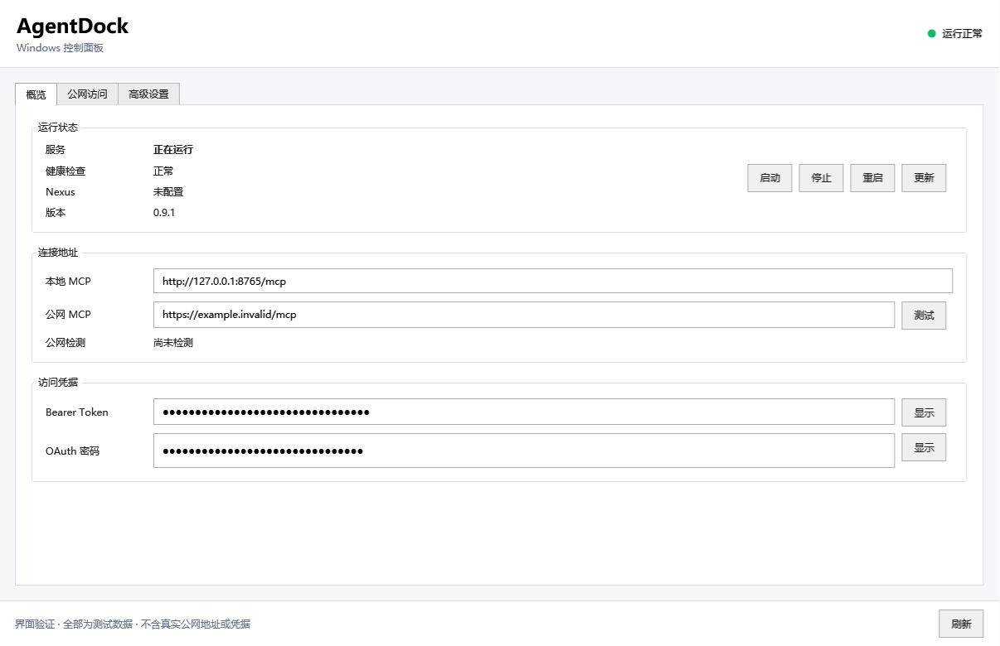
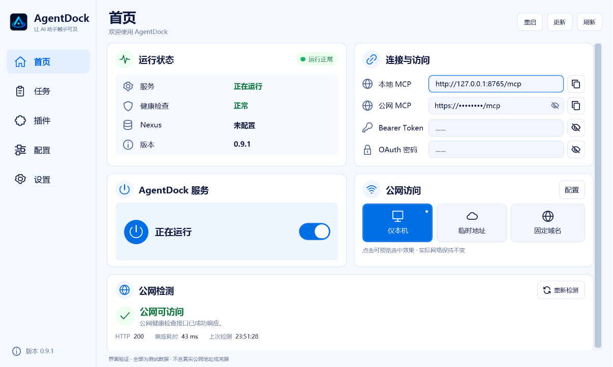
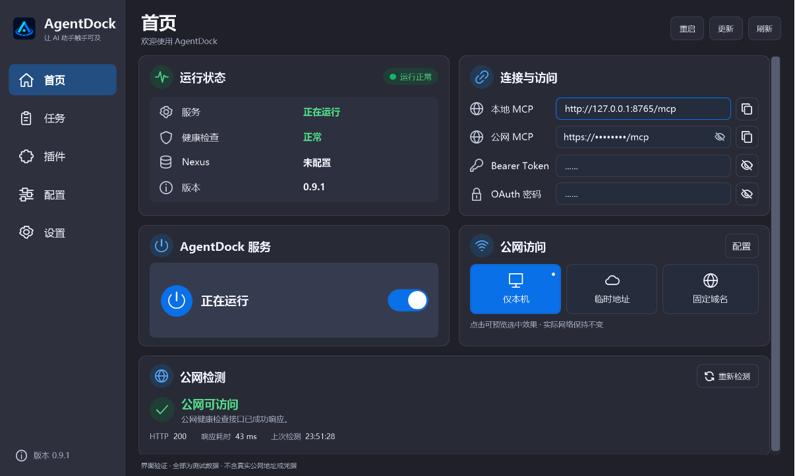
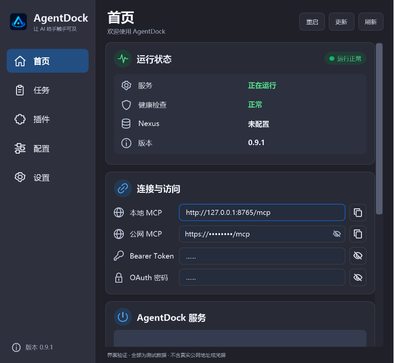
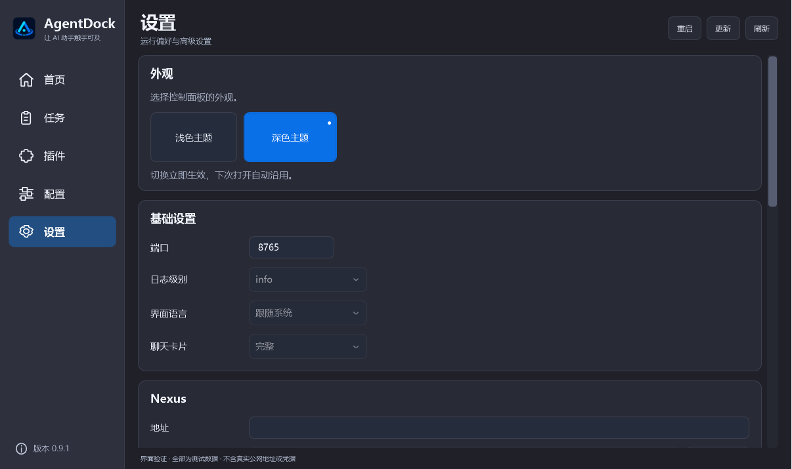
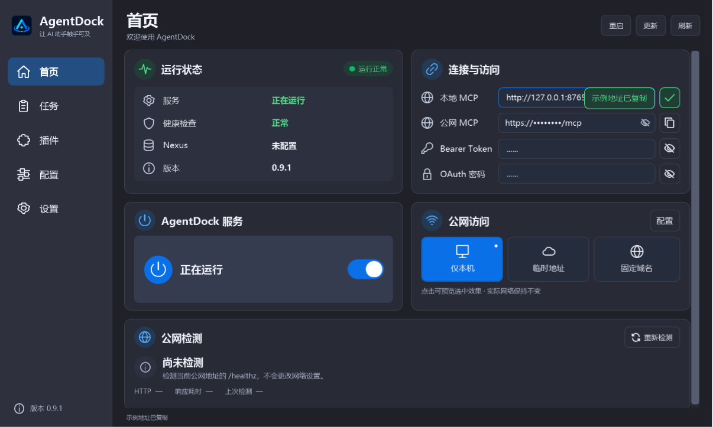
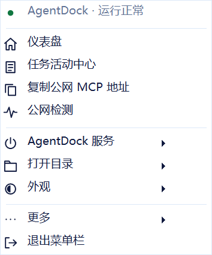
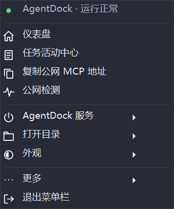

# Windows 控制面板：新版 UI 与原界面对比

这里的“旧版”指官方 0.9.1 的原控制面板，“新版”指本次 UI 改动，不表示升级 Core 或更换运行时。设计采用侧栏和卡片布局，继续使用原生 WPF 与 Windows NotifyIcon。

## 平台范围

本次先提交 Windows 控制面板，不修改 macOS 源码，也不声称已经完成双端统一。浅深主题、信息分组和交互反馈可作为后续 macOS / Windows 统一设计的讨论基础；系统窗口、菜单及权限交互继续遵循各自平台约定。

## 具体变化

| 区域 | 原界面 | 本次改动 |
| --- | --- | --- |
| 导航 | 顶部“概览 / 公网访问 / 高级设置” | 左侧“首页 / 任务 / 插件 / 配置 / 设置”；任务与插件仅为明确标注的预留页面 |
| 首页 | 按传统 GroupBox 展示信息和操作 | 对齐的运行状态、连接与访问、服务和公网模式卡片，下方显示公网检测 |
| 顶部操作 | 重启、更新等操作放在内容区域 | 右上统一“重启 / 更新 / 刷新”，原事件处理保留，服务卡片不重复放置 |
| 品牌 | 原应用图标 | 品牌区域直接引用仓库内官方 PNG，与原图像素一致，不重绘近似图标 |
| 公网模式 | 配置页选择模式并应用 | 首页选择“仅本机 / 临时地址 / 固定域名”，复用原执行流程；配置页只显示相关参数与操作 |
| 公网检测 | 状态文字位于配置区域 | 首页独立卡片显示状态、HTTP 状态码、耗时和检测时间，支持重新检测，不展示活动格子图 |
| 地址与凭据 | 连接信息和凭据分区展示 | 集中展示；公网地址默认视觉遮罩，Bearer/OAuth 统一点状隐藏，保留显隐按钮 |
| 复制 | 缺少同等的主界面就近反馈 | 复制成功变为绿色勾选并显示提示；失败和空值明确提示，重复点击不会提前清除新反馈 |
| 外观 | 默认浅色及系统控件风格 | 设置中即时切换浅色/深色并保存独立 UI 偏好；输入框、下拉框、菜单和子菜单同步 |
| 托盘菜单 | 平铺系统菜单 | 分组为常用入口、服务、目录、外观及更多；保留原有操作，新增首页检测/主题入口，设置与托盘主题双向同步 |
| 窗口缩放 | 固定布局为主 | 内容区根据设备无关宽度在双列/单列间重排，窄屏表单标签上移，按钮支持合理换行 |

## 交互与实现边界

首页模式入口复用原 `RuntimeService` 调用和异常处理。固定域名缺少有效 HTTPS 地址或 Tunnel Token 时进入配置页；应用过程中阻止重复操作，失败时恢复原选择。这里是入口和状态呈现的改变，不是重写 Tunnel 实现。

公网检测继续使用原 HTTP 检测方法，保留自动检测节流，增加手动重测、防重入、旧请求结果丢弃以及统一的成功/失败/超时/未配置状态。错误卡片不回显异常中可能包含的私有地址。HTTP 可达不等于全部工具端到端验收。

复制只在写入剪贴板成功后显示成功状态。反馈使用各按钮的操作序号和独立提示序号，避免旧延时清除后一次操作的反馈。

托盘继续由原 NotifyIcon 托管，服务启停、重启、检查更新、打开目录、文档和退出动作复用原回调。主题通过独立的调色板和 UI 偏好保存，不改网络或服务配置。右键菜单的外观选择同步主窗口，设置中的选择也同步托盘及子菜单。

Core、认证、权限和升级实现不在本次改动范围。任务、插件页面明确显示“尚未接入”，不是已实现的管理功能；没有虚构任务数量或使用热力图数据。

## 验证与复现

附带独立 WPF/WinForms 验证程序：

```powershell
powershell.exe -NoProfile -File desktop/windows/control-panel.tests/run.ps1
```

需要交互式 Windows 桌面和兼容 .NET 8 Windows Desktop 目标的 SDK。程序只使用固定测试快照，替换 HTTP 检测及剪贴板写入端点，不调用生产 App 启动流程，不读取已安装实例的公网地址或凭据；偏好写入和结果均位于本次测试目录。

中文、英文各 192 项 UI 检查涵盖主题保存/失败回退、复制反馈、七种窗口尺寸、DPI 渲染模拟、模式入口、HTTP 检测状态/防重入/旧结果保护、托盘菜单回调与子菜单配色、顶部操作位置、官方图标像素一致性。此数量不等于 192 项真实服务操作。

另在正式控制面板完成了 54 项界面操作、22 项托盘/主题/公网检测、15 项连接认证及 9 项顶部布局检查。真实公网检测返回 HTTP 200；未公开这些实机检查中的配置、地址、凭据或日志。

`go test ./scripts/test -count=1` 的 74 项源码契约检查通过。两个依赖旧菜单组织或源码文件位置的断言已改为检查新结构，仍覆盖原生菜单关闭、更新流程和敏感信息边界，没有删除检查来规避失败。

完整 Go 套件并非一次全部通过：初次运行记录 1578 项通过、77 项跳过、5 项失败，其中上述 2 项 UI 契约检查已修正并通过；2 项 DPAPI 并发锁测试独立复测通过；`TestStopBinaryProcessesTerminatesProcessThatReappearsDuringStop` 因测试辅助进程启动被系统拒绝仍失败，未修改的官方 0.9.1 基线也复现相同问题。此项保留为环境限制，没有将其记为通过。

实际 Core 启停、升级安装、权限变更和真实公网模式切换未作为本轮 UI 回归的实机操作执行，不能据此宣称所有底层功能完整验收。

## 脱敏截图

下图全部由隔离程序使用测试数据渲染：公网示例使用保留的 `.invalid` 域名或遮罩，凭据为固定示例且默认隐藏。没有上传真实桌面截图，图片文本元数据也已移除。旧版截图来自官方 0.9.1 原布局及样式。

### 官方原界面



### 新版浅色与深色





### 窄窗口、外观设置与复制反馈







### 托盘菜单与子菜单






